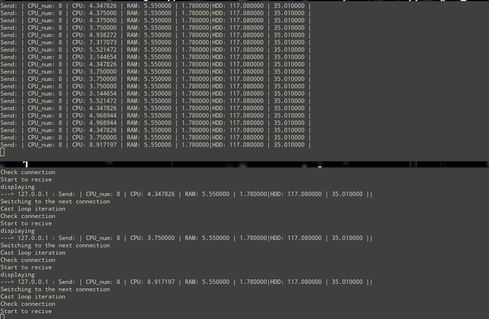

<h1>TelemetryService</h1>

<h2>Description</h2>

Multithreaded Client-server service for collecting telemetry over TLS. Meaning CPU load, num of cores, RAM, HDD.

<h2>Related works</h2>

* [Python version](https://github.com/Ozanis/sslsock_client_server)

<h2>Requirements</h2>

* OpenSSL

<h2>Content</h2>

1 Client-side
2 Server-side
3 Bash-script for solving dependencies
4 Bash daemon set-up

<h2>Explanations</h2>

You can run both applications as systemd services using provided bash script.
You need to run  TelemetryAgent/Sservice/config.sh and enter "client" or "server" when script asked. So agent will have gone setup as follows. Also you may accept them to autorun on boot (or not if you rehect the option : -) )

<h2>Demo</h2>
                               
    
                                                                                                   

_runs only for linux_
